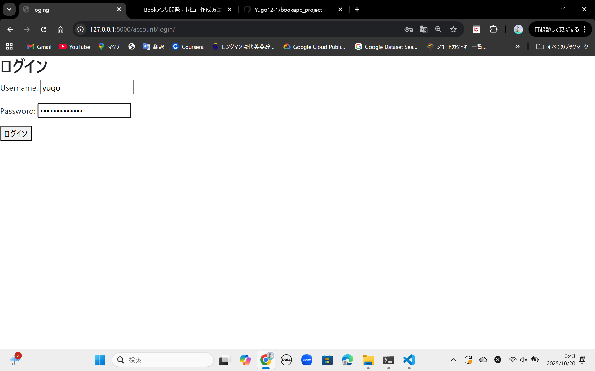
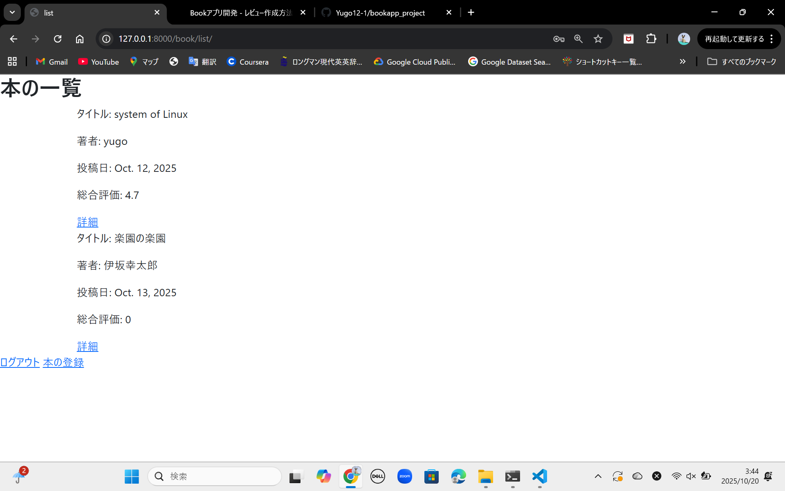
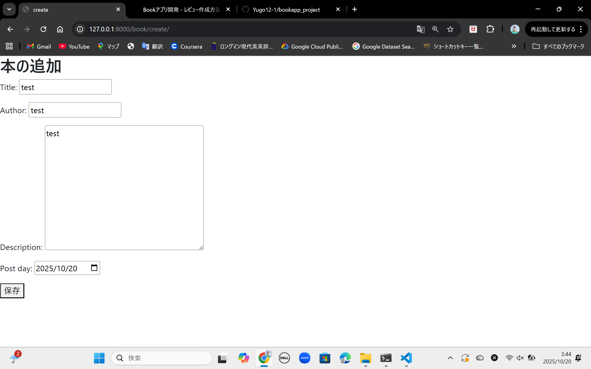
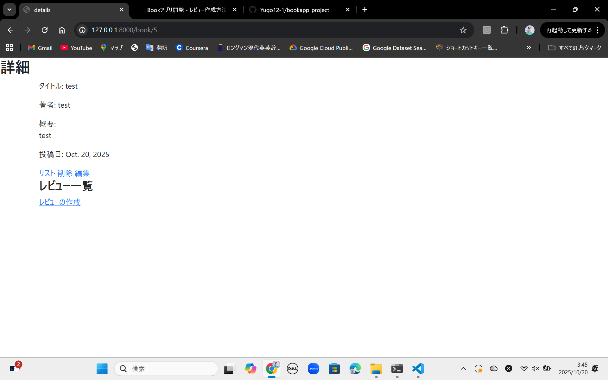
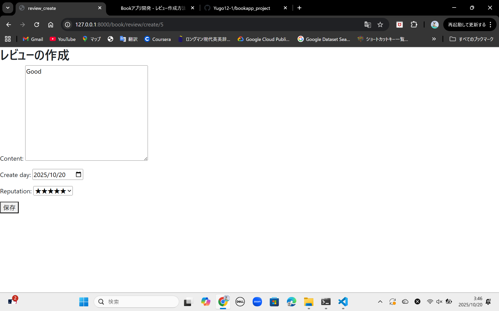
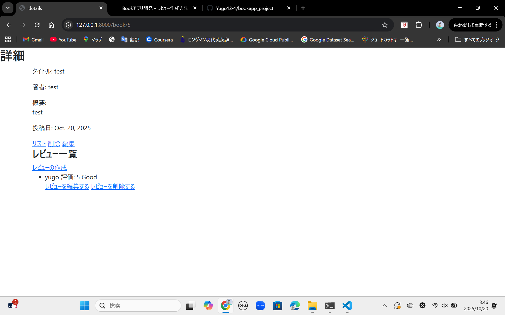
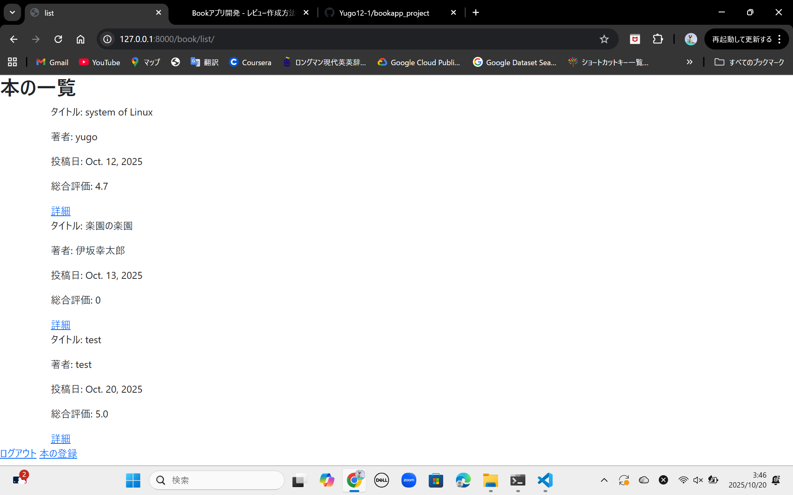

# 📚 BookApp - Django CRUD Sample

DjangoのFunction-Based Viewで実装したシンプルな本のレビューアプリです。  
本の登録・編集・削除・一覧表示（CRUD）を行うことができます。
ログイン機能やレビュー機能を実装しています。

---

## 🚀 Features
- 本のタイトル・著者・概要を登録可能
- Function-Based View でシンプルに実装
- DjangoのFormとModelを連携
- 管理画面でBookの管理が可能
- ログイン機能とレビュー機能の実装
- 総合評価機能の実装

---

## 🧩 Tech Stack
- Python 3.10.12
- Django 5.2.6
- HTML / CSS（templates使用）
- SQLite（開発用DB）

---

## 💻 スクリーンショット

### 🔐 ログイン / サインアップ画面

<p align="center">
  
</p>

---

### 📚 本の一覧表示
<p align="center">
  
  
  
</p>

---

### 🔎 本の詳細とreview機能
<p align="center">
  
  
  
</p>

---

### ⭐ 総合評価
<p align="center">
  
</p>

---


## ⚙️ Setup

1. 仮想環境を作成して有効化：
   ```bash
   python -m venv venv
   source venv/Scripts/activate   # Windowsの場合

2. 依存パッケージをインストール:
   ```bash
   pip install django

3. マイグレーションを実行 
   ```bash
   python3 manage.py makemigrations
   python3 manage.py migrate

4. スーパーユーザーの作成(DB)
   ```bash
   python manage.py createsuperuser

5. 開発サーバーの起動
   ```bash
   python manage.py runserver

6. ブラウザアクセス
   ```bash
   http://127.0.0.1:8000/

---

## 🌳 File tree

   ```bash
      .
      ├── README.md
      ├── book
      │   ├── __init__.py
      │   ├── __pycache__
      │   ├── asgi.py
      │   ├── settings.py
      │   ├── urls.py
      │   └── wsgi.py
      ├── bookapp
      │   ├── __init__.py
      │   ├── __pycache__
      │   ├── admin.py
      │   ├── apps.py
      │   ├── form.py
      │   ├── migrations
      │   ├── models.py
      │   ├── templatetags
      │   ├── tests.py
      │   ├── urls.py
      │   └── views.py
      ├── db.sqlite3
      ├── manage.py
      ├── templates
      │   ├── account
      │   ├── base.html
      │   ├── book
      │   └── review
      └── venv
         ├── bin
         ├── include
         ├── lib
         ├── lib64 -> lib
         └── pyvenv.cfg
   ```

---

## 🗺️ E-R picture

- BookUser (1) -----< (多) Book
- BookUser (1) -----< (多) Review
- Book (1) -----< (多) Review
   ```bash
   BookUser
      |----< Book
      |       |-----< Review
      |-------------------------< Review
   ```